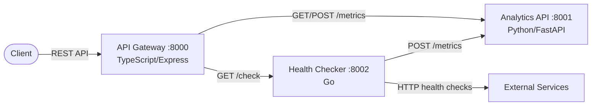
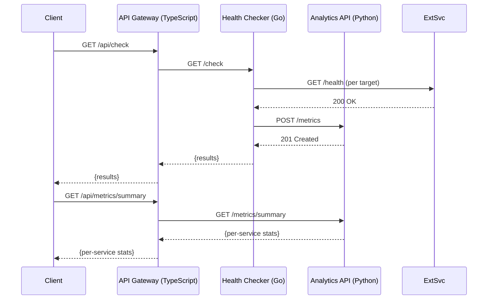

# PulseBoard

Service health monitoring and analytics platform built with a polyglot microservice architecture using Python, Go, and TypeScript.

## Overview

PulseBoard collects health check metrics from monitored services, analyzes uptime and response time trends, and provides a unified API gateway for accessing all monitoring data.

- **Analytics API** (Python/FastAPI) — Receives and stores health check metrics, computes per-service uptime and response time summaries.
- **Health Checker** (Go) — Periodically checks registered service health endpoints and reports results to the Analytics API.
- **API Gateway** (TypeScript/Express) — Unified entry point that routes requests to internal services and aggregates system-wide status.

## Architecture





## Quick Start

### Prerequisites

- Docker and Docker Compose
- Or individually: Python 3.12+, Go 1.22+, Node.js 22+

### Using Docker Compose

```bash
cp .env.example .env
make up        # Start all services
make logs      # View logs
make down      # Stop all services
```

### Manual Setup

```bash
# Analytics API (Python)
cd analytics-api
pip install -r requirements.txt
uvicorn main:app --host 0.0.0.0 --port 8001

# Health Checker (Go)
cd health-checker
go run main.go

# API Gateway (TypeScript)
cd api-gateway
npm install
npm run build
npm start
```

## API Reference

### API Gateway (port 8000)

| Method | Endpoint | Description |
|--------|----------|-------------|
| GET | `/health` | Health check |
| GET | `/api/metrics` | List all metrics (proxy to Analytics API、`?q=` で service 名部分一致検索) |
| GET | `/api/metrics/summary` | Per-service uptime and response time summary（`?q=` で service 名部分一致検索） |
| GET | `/api/metrics/overview` | 全サービス横断のトップレベル稼働サマリ（proxy to Analytics API、`?q=` で部分一致検索） |
| GET | `/api/metrics/services` | サービス一覧（`?q=` で部分一致検索、`?sort=` / `?order=` / `?limit=` / `?offset=`） |
| GET | `/api/metrics/services/names` | distinct な service 名一覧のみを返す軽量エンドポイント（フィルタドロップダウン populate 用、`?q=` / `?since=` / `?until=` / `?order=` / `?limit=` / `?offset=`） |
| GET | `/api/metrics/timeseries` | 時系列バケット集計（`?bucket_seconds=` でバケット幅を指定、既定 60 秒） |
| GET | `/api/metrics/uptime` | 全サービス横断の SLA 集約（uptime_pct / MTTR / 進行中インシデント。`?q=` / `?since=` / `?until=` / `?ongoing_only=` / `?limit=` / `?offset=` / `?order=`） |
| POST | `/api/metrics` | Record a metric (proxy to Analytics API) |
| GET | `/api/check` | Run health checks on all targets (proxy to Checker) |
| GET | `/api/status` | Aggregated health status of all internal services |

#### Record a Metric

```bash
curl -X POST http://localhost:8000/api/metrics \
  -H "Content-Type: application/json" \
  -d '{"service": "web", "status": "healthy", "response_time_ms": 42.5}'
```

Response:

```json
{
  "recorded": true,
  "service": "web",
  "timestamp": 1700000000.0
}
```

#### Get Summary

```bash
curl http://localhost:8000/api/metrics/summary
```

Response:

```json
{
  "web": {
    "total_checks": 10,
    "healthy_checks": 9,
    "uptime_pct": 90.0,
    "avg_response_ms": 45.2
  }
}
```

#### Get Overview

サービスごとではなく、フィルタ後の全レコードを 1 つに集約した全体像を返す。
ダッシュボードのヘッダで「いま全体でどうなっているか」を 1 リクエストで把握する用途。
`?service=` / `?status=` / `?since=` / `?until=` で絞り込める。`?q=` で service 名の大文字小文字無視の部分一致検索も可能。

```bash
curl http://localhost:8000/api/metrics/overview
```

Response:

```json
{
  "total_records": 30,
  "services_count": 3,
  "status_counts": {"healthy": 27, "unhealthy": 2, "degraded": 1, "unknown": 0},
  "overall_uptime_pct": 90.0,
  "response_time_ms": {
    "avg": 45.2, "min": 10.0, "max": 320.0,
    "p50": 40.0, "p95": 180.0, "p99": 300.0
  },
  "earliest_timestamp": 1700000000.0,
  "latest_timestamp": 1700003600.0
}
```

### Analytics API (port 8001)

| Method | Endpoint | Description |
|--------|----------|-------------|
| GET | `/health` | Health check |
| POST | `/metrics` | Record a health check metric |
| GET | `/metrics` | List metrics (`?service=`, `?since=`, `?until=`, `?limit=`, `?offset=`） |
| DELETE | `/metrics` | サービス名 / 時刻 を組合せて対象メトリクスを削除（`?service=` / `?before=`） |
| GET | `/metrics/summary` | Per-service summary statistics |
| GET | `/metrics/overview` | 全レコードを 1 つに集約したトップレベル稼働サマリ（`?service=` / `?status=` / `?since=` / `?until=`） |
| GET | `/metrics/services` | サービス一覧（観測数・healthy 数・uptime%・最新ステータス・初回／最終観測時刻） |
| GET | `/metrics/services/names` | distinct な service 名のみを返す軽量エンドポイント（per-service 集計を行わずペイロード最小化、`?q=` / `?since=` / `?until=` / `?order=` / `?limit=` / `?offset=`） |
| GET | `/metrics/count` | フィルタ後のレコード件数・status 別件数・登場サービス数のみを返す軽量エンドポイント（`?service=` / `?status=` / `?since=` / `?until=` / `?q=`） |
| GET | `/metrics/timeseries` | フィルタ後のレコードを `bucket_seconds` 秒幅の時系列バケットに集約（`?bucket_seconds=` / `?service=` / `?status=` / `?since=` / `?until=` / `?q=`） |
| GET | `/metrics/services/{service_name}/timeseries` | 単一サービスに絞った時系列バケット集計（`?bucket_seconds=` / `?status=` / `?since=` / `?until=`）。該当サービスが存在しなければ 404 |
| GET | `/metrics/services/{service_name}/latest` | 単一サービスの直近 1 件の observation を `{service, status, response_time_ms, timestamp}` 形で返す軽量エンドポイント（`?since=` / `?until=`）。該当サービスが存在しなければ 404 |

#### Delete Metrics

`?service=` と `?before=`（Unix timestamp）の一方または両方を指定する。両方とも未指定の場合は 400。

```bash
# サービス名指定（全件削除）
curl -X DELETE "http://localhost:8001/metrics?service=web"

# 時刻ベース削除（指定 timestamp より前のレコードを削除、境界は strict <）
curl -X DELETE "http://localhost:8001/metrics?before=1700000000"

# 組合せ（AND 条件：web で timestamp が 1700000000 より前のレコードのみ削除）
curl -X DELETE "http://localhost:8001/metrics?service=web&before=1700000000"
```

レスポンス:

```json
{"message":"Metrics deleted","service":"web","before":1700000000,"deleted_count":3}
```

#### List Metrics (paginated)

```bash
# デフォルト（METRICS_DEFAULT_LIMIT 件まで）
curl http://localhost:8001/metrics

# limit / offset 指定
curl "http://localhost:8001/metrics?limit=20&offset=40"

# サービス絞り込み + ページネーション
curl "http://localhost:8001/metrics?service=web&limit=10"

# 時刻範囲指定（Unix timestamp、since 以降 / until 以前）
curl "http://localhost:8001/metrics?since=1700000000&until=1700003600"

# 時刻範囲 + サービス絞り込みの組合せ
curl "http://localhost:8001/metrics?service=web&since=1700000000"
```

`since > until` の場合は 400、負値・非有限値は 422 で拒否される。

レスポンス:

```json
{
  "count": 20,
  "total": 137,
  "limit": 20,
  "offset": 40,
  "metrics": [{"service":"web","status":"healthy","response_time_ms":42.5,"timestamp":1700000000.0}]
}
```

#### List Services with Uptime

`/metrics/services` はサービスごとに集約済みの観測情報を返す。レスポンスに `total_checks` / `healthy_checks` / `uptime_pct` が含まれるため、サービス一覧と稼働率を 1 リクエストで取得できる。

```bash
# デフォルト（service 名昇順）
curl http://localhost:8001/metrics/services

# 稼働率の低い順（運用上の発見クエリ）
curl "http://localhost:8001/metrics/services?sort=uptime_pct&order=asc"

# healthy 件数の多い順
curl "http://localhost:8001/metrics/services?sort=healthy_checks&order=desc"
```

`sort` の候補は `service` / `total_checks` / `healthy_checks` / `uptime_pct` / `last_seen` / `first_seen` / `latest_status`。

レスポンス例:

```json
{
  "count": 2,
  "total": 2,
  "limit": 100,
  "offset": 0,
  "sort": "service",
  "order": "asc",
  "services": [
    {
      "service": "api",
      "total_checks": 4,
      "healthy_checks": 3,
      "uptime_pct": 75.0,
      "first_seen": 1.0,
      "last_seen": 4.0,
      "latest_status": "healthy"
    },
    {
      "service": "db",
      "total_checks": 2,
      "healthy_checks": 1,
      "uptime_pct": 50.0,
      "first_seen": 1.0,
      "last_seen": 2.0,
      "latest_status": "unhealthy"
    }
  ]
}
```

`uptime_pct` は `healthy_checks / total_checks * 100`（小数点 2 桁丸め、`total_checks == 0` の場合 `0`）。

#### List Service Names Only

`/metrics/services/names` は distinct な service 名のみを返す。`/metrics/services` のような per-service の uptime / first_seen / last_seen / percentile などフル集計を行わないため、フィルタドロップダウンの populate のように「名前だけ欲しい」用途で /metrics/services よりも小さなペイロード・低コストで応答できる。

```bash
# 全 service 名（昇順）
curl http://localhost:8001/metrics/services/names

# 名前に "api" を含むものだけ（大文字小文字無視）
curl "http://localhost:8001/metrics/services/names?q=api"

# 名前降順 + ページング
curl "http://localhost:8001/metrics/services/names?order=desc&limit=10&offset=0"

# 直近 1 時間に観測された service 名のみ
curl "http://localhost:8001/metrics/services/names?since=$(($(date +%s) - 3600))"
```

レスポンス例:

```json
{
  "count": 3,
  "total": 3,
  "limit": 100,
  "offset": 0,
  "order": "asc",
  "names": ["api-gateway", "billing", "user-service"]
}
```

#### Count Only

`/metrics/count` はフィルタに合致するレコード本体を返さず、件数・status 別件数・登場サービス数だけを返す軽量エンドポイント。`/metrics?limit=1` 相当のメタデータだけが必要な UI（バッジ表示・ページャ初期化・「X サービス × Y チェック」サマリーなど）向けで、レコードの JSON 直列化コストを避けられる。

```bash
# 全件カウント
curl http://localhost:8001/metrics/count

# サービス絞り込み
curl "http://localhost:8001/metrics/count?service=web"

# status + 時間範囲
curl "http://localhost:8001/metrics/count?status=unhealthy&since=1700000000"

# 部分一致検索（大文字小文字無視）
curl "http://localhost:8001/metrics/count?q=api"
```

レスポンス例:

```json
{
  "total": 6,
  "services": 3,
  "by_status": {"healthy": 3, "unhealthy": 1, "degraded": 1, "unknown": 1}
}
```

`by_status` は `ALLOWED_STATUSES` の全キーを 0 で初期化したマップで返るため、クライアントは存在チェックなしで参照できる。`services` はフィルタ通過後のレコードに登場した service 名のユニーク数（status / since / until / q によるフィルタは反映済み）。

#### Get Timeseries

`/metrics/timeseries` はフィルタ後のレコードを `bucket_seconds` 秒幅の半開区間 `[bucket_start, bucket_start + bucket_seconds)` でグルーピングし、バケット単位の集計を返す。ダッシュボードの時系列チャートなど、サーバ側でビニング済みのデータが欲しいケース向け。

```bash
# 既定 (60秒バケット)
curl http://localhost:8001/metrics/timeseries

# 5分バケット + service / status / since の絞り込み
curl "http://localhost:8001/metrics/timeseries?bucket_seconds=300&service=web&status=healthy&since=1700000000"
```

`bucket_seconds` は `1`〜`86400`（1秒〜1日）。レコードのない時刻のバケットは返さない（スパース表現）。並び順は `bucket_start` 昇順。

レスポンス例:

```json
{
  "bucket_seconds": 60,
  "count": 2,
  "buckets": [
    {
      "bucket_start": 1700000000.0,
      "total": 3,
      "by_status": {"healthy": 2, "unhealthy": 1, "degraded": 0, "unknown": 0},
      "avg_response_ms": 30.0
    },
    {
      "bucket_start": 1700000060.0,
      "total": 1,
      "by_status": {"healthy": 1, "unhealthy": 0, "degraded": 0, "unknown": 0},
      "avg_response_ms": 70.0
    }
  ]
}
```

`by_status` は `ALLOWED_STATUSES` の全キーを 0 初期化したマップで返るため、クライアントは存在チェックなしで参照できる。

#### Service Timeseries

`/metrics/services/{service_name}/timeseries` は単一サービスに絞った時系列バケットを返す。`/metrics/timeseries?service=X` と同じ buckets 形（`bucket_start` / `total` / `by_status` / `avg_response_ms` / `min_response_ms` / `max_response_ms` / `p50_response_ms` / `p95_response_ms` / `p99_response_ms`）に `service` フィールドを付与して返す。サービス起点で URL を組み立てられるため、ダッシュボードのサービス詳細画面から 1 リクエストで時系列データを取り回せる。

該当サービスのレコードが (`since` / `until` 範囲内に) 1 件も無い場合は `404 No metrics found for service '...'` を返す（`/metrics/services/{service_name}` 詳細エンドポイントと同じセマンティクス）。一方、`status` フィルタはあくまでバケット内の集計を絞り込むだけで、存在判定には影響しない（サービス自体は存在するが指定 status のレコードが 0 件なら、空 `buckets` の 200 が返る）。

```bash
# 既定 (60秒バケット)
curl http://localhost:8001/metrics/services/web/timeseries

# 5分バケット + status 絞り込み + 時間範囲
curl "http://localhost:8001/metrics/services/web/timeseries?bucket_seconds=300&status=healthy&since=1700000000&until=1700003600"
```

### Health Checker (port 8002)

| Method | Endpoint | Description |
|--------|----------|-------------|
| GET | `/health` | Health check |
| GET | `/check` | Run health checks on all configured targets |

**バックグラウンド定期チェック (Periodic checks):**

`CHECK_INTERVAL_SECONDS` に正の整数（秒）を指定すると、`/check` を外部から
呼ばなくてもバックグラウンドで全ターゲットを定期チェックし、結果を
`analytics-api` に report する。`docker compose up` しただけでメトリクスが
継続的に蓄積されるため、デモや動作確認の足がかりとして便利。

- `CHECK_INTERVAL_SECONDS=0`（既定）: 無効。これまで通り `/check` 呼び出し時のみ動作（後方互換）
- `CHECK_INTERVAL_SECONDS=30`: 起動時に即時 1 回実行し、その後 30 秒ごとに繰り返す
- SIGINT / SIGTERM 受信時にループは速やかに停止し、graceful shutdown を阻害しない

**メトリクス報告の再送 (Metric reporting retries):**

各ターゲットのチェック結果は analytics-api の `POST /metrics` に送信される。
analytics-api の一時的な障害（接続エラー、5xx、429 Too Many Requests）に対しては
指数バックオフで自動リトライする。

- 試行回数は `METRIC_REPORT_MAX_ATTEMPTS`（既定 `3`、`1` でリトライ無効）
- 初期バックオフは `METRIC_REPORT_BACKOFF_MS`（既定 `100`）。`backoff × 2^(n-1)` で増加
- 4xx（429 を除く）はリクエスト不備なので即時失敗とする

## Configuration

All services are configured via environment variables. See [`.env.example`](.env.example) for the full list.

| Variable | Default | Description |
|----------|---------|-------------|
| `ANALYTICS_PORT` | `8001` | Analytics API listen port |
| `CHECKER_PORT` | `8002` | Health Checker listen port |
| `GATEWAY_PORT` | `8000` | API Gateway listen port |
| `ANALYTICS_URL` | `http://localhost:8001` | Analytics API URL (used by Gateway and Checker) |
| `CHECKER_URL` | `http://localhost:8002` | Health Checker URL (used by Gateway) |
| `LOG_LEVEL` | `INFO` | Log verbosity (DEBUG, INFO, WARNING, ERROR) |
| `MAX_RECORDS` | `10000` | Analytics API: 保存するメトリクスの最大件数 |
| `METRICS_DEFAULT_LIMIT` | `100` | Analytics API: `GET /metrics` のデフォルト返却件数 |
| `METRICS_MAX_LIMIT` | `1000` | Analytics API: `GET /metrics` の `limit` 上限 |
| `SHUTDOWN_TIMEOUT_SECONDS` | `30` | Health Checker: graceful shutdown 待機時間（秒） |
| `CHECKER_READ_HEADER_TIMEOUT` | `5` | Health Checker: HTTP リクエストヘッダ読み取りタイムアウト（秒） |
| `CHECKER_READ_TIMEOUT` | `15` | Health Checker: HTTP リクエスト全体の読み取りタイムアウト（秒） |
| `CHECKER_WRITE_TIMEOUT` | `15` | Health Checker: HTTP レスポンス書き込みタイムアウト（秒） |
| `CHECKER_IDLE_TIMEOUT` | `60` | Health Checker: keep-alive アイドルタイムアウト（秒） |
| `METRIC_REPORT_MAX_ATTEMPTS` | `3` | Health Checker: analytics-api への POST `/metrics` 最大試行回数（`1` でリトライ無効） |
| `METRIC_REPORT_BACKOFF_MS` | `100` | Health Checker: メトリクス報告の指数バックオフ初期値（ミリ秒） |
| `CHECK_INTERVAL_SECONDS` | `0` | Health Checker: バックグラウンド定期チェックの間隔（秒、`0` で無効） |
| `CHECK_HTTP_TIMEOUT_SECONDS` | `5` | Health Checker: 各サービス `/health` チェックおよび analytics-api への POST に使う HTTP クライアントのタイムアウト（秒）。高遅延ネットワーク環境では大きめに設定する。`0` や不正値の場合は既定値にフォールバック |

## Testing

```bash
make test          # Run all tests
make test-python   # Python tests only (pytest)
make test-go       # Go tests only (go test)
make test-ts       # TypeScript tests only (jest)
make lint          # Run all linters
```

## CI/CD

GitHub Actions workflow (`.github/workflows/ci.yml`) runs on every push and PR to `main`:

1. **test-python** — flake8 lint + pytest
2. **test-go** — go vet + go test
3. **test-typescript** — eslint + jest
4. **docker-build** — Docker Compose build verification (after all tests pass)

## Project Structure

```
pulseboard/
├── api-gateway/              # TypeScript API Gateway
│   ├── src/
│   │   ├── app.ts
│   │   ├── app.test.ts
│   │   └── index.ts
│   ├── package.json
│   ├── tsconfig.json
│   ├── jest.config.js
│   ├── .eslintrc.json
│   └── Dockerfile
├── analytics-api/            # Python Analytics API
│   ├── main.py
│   ├── test_main.py
│   ├── requirements.txt
│   └── Dockerfile
├── health-checker/           # Go Health Checker
│   ├── main.go
│   ├── main_test.go
│   ├── go.mod
│   └── Dockerfile
├── .github/
│   └── workflows/
│       └── ci.yml
├── docker-compose.yml
├── Makefile
├── .env.example
├── .gitignore
└── README.md
```

## License

MIT
