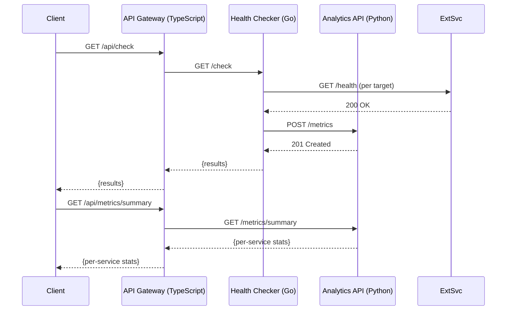

# PulseBoard

Service health monitoring and analytics platform built with a polyglot microservice architecture using Python, Go, and TypeScript.

## Overview

PulseBoard collects health check metrics from monitored services, analyzes uptime and response time trends, and provides a unified API gateway for accessing all monitoring data.

- **Analytics API** (Python/FastAPI) — Receives and stores health check metrics, computes per-service uptime and response time summaries.
- **Health Checker** (Go) — Periodically checks registered service health endpoints and reports results to the Analytics API.
- **API Gateway** (TypeScript/Express) — Unified entry point that routes requests to internal services and aggregates system-wide status.

## Architecture




## Quick Start

### Prerequisites

- Docker and Docker Compose
- Or individually: Python 3.12+, Go 1.22+, Node.js 22+

### Using Docker Compose

```bash
cp .env.example .env
make up        # Start all services
make logs      # View logs
make down      # Stop all services
```

### Manual Setup

```bash
# Analytics API (Python)
cd analytics-api
pip install -r requirements.txt
uvicorn main:app --host 0.0.0.0 --port 8001

# Health Checker (Go)
cd health-checker
go run main.go

# API Gateway (TypeScript)
cd api-gateway
npm install
npm run build
npm start
```

## API Reference

### API Gateway (port 8000)

| Method | Endpoint | Description |
|--------|----------|-------------|
| GET | `/health` | Health check |
| GET | `/api/metrics` | List all metrics (proxy to Analytics API) |
| GET | `/api/metrics/summary` | Per-service uptime and response time summary |
| POST | `/api/metrics` | Record a metric (proxy to Analytics API) |
| GET | `/api/check` | Run health checks on all targets (proxy to Checker) |
| GET | `/api/status` | Aggregated health status of all internal services |

#### Record a Metric

```bash
curl -X POST http://localhost:8000/api/metrics \
  -H "Content-Type: application/json" \
  -d '{"service": "web", "status": "healthy", "response_time_ms": 42.5}'
```

Response:

```json
{
  "recorded": true,
  "service": "web",
  "timestamp": 1700000000.0
}
```

#### Get Summary

```bash
curl http://localhost:8000/api/metrics/summary
```

Response:

```json
{
  "web": {
    "total_checks": 10,
    "healthy_checks": 9,
    "uptime_pct": 90.0,
    "avg_response_ms": 45.2
  }
}
```

### Analytics API (port 8001)

| Method | Endpoint | Description |
|--------|----------|-------------|
| GET | `/health` | Health check |
| POST | `/metrics` | Record a health check metric |
| GET | `/metrics` | List metrics (`?service=`, `?limit=`, `?offset=`） |
| DELETE | `/metrics?service=` | サービス名指定で対象メトリクスを削除 |
| GET | `/metrics/summary` | Per-service summary statistics |

#### List Metrics (paginated)

```bash
# デフォルト（METRICS_DEFAULT_LIMIT 件まで）
curl http://localhost:8001/metrics

# limit / offset 指定
curl "http://localhost:8001/metrics?limit=20&offset=40"

# サービス絞り込み + ページネーション
curl "http://localhost:8001/metrics?service=web&limit=10"
```

レスポンス:

```json
{
  "count": 20,
  "total": 137,
  "limit": 20,
  "offset": 40,
  "metrics": [{"service":"web","status":"healthy","response_time_ms":42.5,"timestamp":1700000000.0}]
}
```

### Health Checker (port 8002)

| Method | Endpoint | Description |
|--------|----------|-------------|
| GET | `/health` | Health check |
| GET | `/check` | Run health checks on all configured targets |

## Configuration

All services are configured via environment variables. See [`.env.example`](.env.example) for the full list.

| Variable | Default | Description |
|----------|---------|-------------|
| `ANALYTICS_PORT` | `8001` | Analytics API listen port |
| `CHECKER_PORT` | `8002` | Health Checker listen port |
| `GATEWAY_PORT` | `8000` | API Gateway listen port |
| `ANALYTICS_URL` | `http://localhost:8001` | Analytics API URL (used by Gateway and Checker) |
| `CHECKER_URL` | `http://localhost:8002` | Health Checker URL (used by Gateway) |
| `LOG_LEVEL` | `INFO` | Log verbosity (DEBUG, INFO, WARNING, ERROR) |
| `MAX_RECORDS` | `10000` | Analytics API: 保存するメトリクスの最大件数 |
| `METRICS_DEFAULT_LIMIT` | `100` | Analytics API: `GET /metrics` のデフォルト返却件数 |
| `METRICS_MAX_LIMIT` | `1000` | Analytics API: `GET /metrics` の `limit` 上限 |

## Testing

```bash
make test          # Run all tests
make test-python   # Python tests only (pytest)
make test-go       # Go tests only (go test)
make test-ts       # TypeScript tests only (jest)
make lint          # Run all linters
```

## CI/CD

GitHub Actions workflow (`.github/workflows/ci.yml`) runs on every push and PR to `main`:

1. **test-python** — flake8 lint + pytest
2. **test-go** — go vet + go test
3. **test-typescript** — eslint + jest
4. **docker-build** — Docker Compose build verification (after all tests pass)

## Project Structure

```
pulseboard/
├── api-gateway/              # TypeScript API Gateway
│   ├── src/
│   │   ├── app.ts
│   │   ├��─ app.test.ts
���   │   └── index.ts
│   ├── package.json
│   ├── tsconfig.json
│   ├── jest.config.js
│   ├── .eslintrc.json
│   └── Dockerfile
├── analytics-api/            # Python Analytics API
│   ├── main.py
│   ├── test_main.py
│   ├── requirements.txt
│   └── Dockerfile
├���─ health-checker/           # Go Health Checker
│   ├���─ main.go
│   ├── main_test.go
│   ├── go.mod
│   └── Dockerfile
├── .github/
│   └── workflows/
│       └── ci.yml
├── docker-compose.yml
├── Makefile
├── .env.example
├── .gitignore
└── README.md
```

## License

MIT
