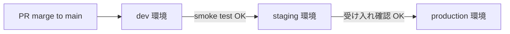

# デプロイ手順書 (Deployment)

PulseBoard の**リリース・デプロイ・環境昇格・ロールバック**手順をまとめたドキュメントです。
障害時の初動は [`docs/RUNBOOK.md`](./RUNBOOK.md)、症状ベースの逆引きは [`docs/TROUBLESHOOTING.md`](./TROUBLESHOOTING.md)、
システム全体像は [`docs/ARCHITECTURE.md`](./ARCHITECTURE.md)、監視設計は [`docs/OBSERVABILITY.md`](./OBSERVABILITY.md) を参照してください。

本書は `docker-compose` を前提とした参照実装を示します。本番オーケストレーション基盤 (Kubernetes / ECS / Nomad など) を利用する場合は、
各コマンドを対応するデプロイ操作に読み替えてください (§2, §6 の注記も参照)。

## 目次

- [1. 対象読者とデプロイモデル](#1-対象読者とデプロイモデル)
- [2. リリース準備チェックリスト](#2-リリース準備チェックリスト)
- [3. ビルドとイメージタグ運用](#3-ビルドとイメージタグ運用)
- [4. 環境昇格フロー (dev → staging → production)](#4-環境昇格フロー-dev--staging--production)
- [5. 設定管理 (.env の取り扱い)](#5-設定管理-env-の取り扱い)
- [6. デプロイ実行手順](#6-デプロイ実行手順)
- [7. デプロイ後の検証](#7-デプロイ後の検証)
- [8. ロールバック手順](#8-ロールバック手順)
- [9. 関連ドキュメント](#9-関連ドキュメント)

---

## 1. 対象読者とデプロイモデル

### 対象読者

- 変更を本番環境へ反映する開発者・SRE
- 初回セットアップを担当するオペレータ
- インシデント時にロールバックを実施する担当者

### デプロイモデル前提

PulseBoard は 3 サービス構成 (`analytics-api` / `health-checker` / `api-gateway`) のマイクロサービス群で、
以下のいずれかの形態でデプロイされることを想定しています。

| 形態                          | 用途                     | 本書での扱い                             |
| ----------------------------- | ------------------------ | ---------------------------------------- |
| `docker-compose`              | ローカル / dev / staging | 主たる参照実装として具体的コマンドを記述 |
| オーケストレーション基盤       | production               | コマンドを読み替える前提で注記を付す     |

いずれの形態でも「サービス単位で独立にビルド・配布・ロールアウトできる」ことを維持してください。
1 サービスの再デプロイが他の 2 サービスを巻き込まないことが、後述するロールバック手順の前提になります。

---

## 2. リリース準備チェックリスト

本番へ反映する PR は、マージ前に以下を満たしてください。

- [ ] 対応 Issue が Closes リンクで紐づいている
- [ ] `make test` が緑 (Python / Go / TypeScript の全テストがローカルでも通る)
- [ ] `make lint` が緑 (flake8 / go vet / eslint)
- [ ] 破壊的変更がある場合は `CHANGELOG.md` に追記
- [ ] 新規環境変数を追加した場合は `.env.example` にサンプル値と説明コメントを追加し、`README.md` の Configuration 表を更新
- [ ] API 追加/変更があれば `README.md` のエンドポイント表と curl 例を更新
- [ ] 監視・アラート観点の影響がある場合は `docs/OBSERVABILITY.md` を更新
- [ ] 障害対応フローに影響する場合は `docs/RUNBOOK.md` / `docs/TROUBLESHOOTING.md` を更新

このチェックリストを PR 本文にコピーするか、PR テンプレートに沿って埋めることを推奨します。

---

## 3. ビルドとイメージタグ運用

### ビルド

ローカル / CI 上で以下のコマンドにより全サービスのイメージを一括ビルドします。

```bash
docker compose build
```

単一サービスのみビルドし直したい場合は以下:

```bash
docker compose build analytics-api
docker compose build health-checker
docker compose build api-gateway
```

### タグ運用の推奨方針

デプロイ済みイメージは以下の 2 タグを常に併記して push することを推奨します。

| タグ                     | 目的                                                                 |
| ------------------------ | -------------------------------------------------------------------- |
| `<service>:<git-sha>`    | **不変**。デプロイ済みバージョンの一意特定に使用 (ロールバック軸)    |
| `<service>:<env>-latest` | **可変**。各環境で稼働中バージョンの最新を指す (`dev-latest` など)   |

- ロールバック時は `<git-sha>` タグを参照し、直前バージョンを一意に復元できます。
- `<env>-latest` は運用上の便宜 (ダッシュボードやログでの識別) 用途に留めてください。

---

## 4. 環境昇格フロー (dev → staging → production)

### 昇格モデル



### 各段階での確認事項

| 環境         | 反映契機                       | 確認事項                                                             |
| ------------ | ------------------------------ | -------------------------------------------------------------------- |
| dev          | main への merge (自動想定)     | `/health` × 3 サービスが 200 / `docker compose ps` が全 healthy      |
| staging      | 明示的な昇格操作 (手動)         | dev で `docker compose ps` が healthy かつ smoke test (§7) が全 pass |
| production   | staging での受け入れ完了後      | staging で N 時間 (例: 30 分) エラー率上昇なし・ロールバック手順を再確認 |

production へ昇格させる直前には、必ず現在稼働中の `<git-sha>` を控え、ロールバック先として明示できるようにしてください。

---

## 5. 設定管理 (.env の取り扱い)

### .env と .env.example の同期

- `.env.example` は**リポジトリの真実**です。新規環境変数は必ずここに追加してください。
- 各環境の `.env` は `.env.example` の**上位互換**として運用します (未定義の変数が存在しないこと)。
- 秘密値 (トークン・パスワード等) は `.env.example` にプレースホルダのみを記載し、実値はシークレット管理システムから配布します。

### 変数変更時のチェックポイント

新規変数を追加 / 既存変数のデフォルトを変更した際は、以下 3 点をセットで更新してください。抜けが起きるとローカルと本番で挙動が乖離します。

1. `.env.example` にキー・サンプル値・コメント
2. `README.md` の Configuration 表
3. 該当サービスの起動時ログ (デフォルト値の可視化があるとオペレータが助かる)

### Health Checker の設定確認

`health-checker` は `GET /config` で実行時設定を JSON 返却するため、環境変数の反映漏れをデプロイ後に即検知できます。
本番反映後の smoke test に組み込むことを推奨します (§7)。

---

## 6. デプロイ実行手順

### 6.1 docker-compose ベース

```bash
# 1. 対象のリビジョンを取得
git fetch --tags
git checkout <release-tag-or-sha>

# 2. .env の同期を確認 (差分が無いこと)
diff .env.example .env || true

# 3. ビルドと起動 (rolling には最低限 1 サービスずつ実施)
docker compose build
docker compose up -d --no-deps analytics-api
docker compose up -d --no-deps health-checker
docker compose up -d --no-deps api-gateway

# 4. 状態確認
docker compose ps
```

- `--no-deps` を付けることで、依存先サービスの再起動を抑止し、影響範囲を最小化できます。
- 逆順 (`analytics-api` → `health-checker` → `api-gateway`) で更新することで、上位サービスから見た依存側の互換ウィンドウを短く保てます。

### 6.2 オーケストレーション基盤への読み替え

本番でオーケストレーション基盤を利用している場合、上記手順は以下に対応します。

| docker-compose 上の操作            | オーケストレーション基盤での対応                              |
| ---------------------------------- | ------------------------------------------------------------- |
| `docker compose build`             | CI 上でのイメージビルド + レジストリ push                     |
| `docker compose up -d --no-deps X` | サービス X のマニフェスト (Deployment / TaskDef) の更新       |
| `docker compose ps`                | `kubectl get pods` / `aws ecs describe-services` などの参照   |
| `docker compose logs -f X`         | ログ基盤 (Cloud Logging / CloudWatch Logs 等) からのクエリ    |

---

## 7. デプロイ後の検証

デプロイ完了後は、少なくとも以下の smoke test を実施してください。
全て成功した時点で「デプロイ完了」と宣言できます。

### 7.1 各サービスの /health

```bash
curl -fsS http://<host>:8000/health && echo
curl -fsS http://<host>:8001/health && echo
curl -fsS http://<host>:8002/health && echo
```

### 7.2 集約ステータス

```bash
curl -fsS http://<host>:8000/api/status | jq
```

各サービスが `healthy` として集約されていることを確認します。

### 7.3 メトリクス書き込み / 読み出しの疎通

```bash
# 書き込み
curl -fsS -X POST http://<host>:8000/api/metrics \
  -H 'Content-Type: application/json' \
  -d '{"service":"smoke","status":"healthy","response_time_ms":1.0}'

# 直後に集計に反映されていることを確認
curl -fsS 'http://<host>:8000/api/metrics/count?service=smoke' | jq
```

### 7.4 Health Checker の実行時設定確認

```bash
curl -fsS http://<host>:8002/config | jq
curl -fsS http://<host>:8002/targets | jq
```

`.env` 相当の値 (`check_interval_seconds` / `analytics_url` / 追加ターゲット) が想定通りに反映されているかを確認します。

### 7.5 観測ダッシュボード

`docs/OBSERVABILITY.md` に記載の SLO / エラー率ダッシュボードで、デプロイ直後に異常が出ていないことを確認してください。
最低でも次の 15 分間はダッシュボードから離れないでください。

---

## 8. ロールバック手順

### 8.1 判断基準

以下のいずれかを満たしたら、原因究明に踏み込む前に**まずロールバック**を優先してください (詳細調査は復旧後)。

- ユーザ影響のある 5xx が 5 分以上継続 (RUNBOOK §4 Sev-1)
- `/health` がいずれかのサービスで持続的に fail
- 集約 (`/api/status`) が `unhealthy` を持続的に返す
- デプロイ前後で SLO を割り込む主要メトリクスの明確な悪化

### 8.2 ロールバック実行

直前バージョンの `<git-sha>` タグを控えている前提で、以下を実行します。

```bash
# 1. 直前バージョンをチェックアウト
git checkout <previous-git-sha>

# 2. 影響を受けたサービスのみを対象に巻き戻す
docker compose up -d --no-deps <affected-service>

# 3. 状態と /health を再確認
docker compose ps
curl -fsS http://<host>:8000/api/status | jq
```

### 8.3 設定変更のみのロールバック

イメージは変えず `.env` のみを変更したケースでは、`.env` のみ revert して再起動します。

```bash
git checkout <previous-sha> -- .env
docker compose up -d --no-deps <affected-service>
```

### 8.4 ロールバック完了の宣言

以下を全て満たした時点で「ロールバック完了」と宣言できます。

- §7 の smoke test が全て pass
- 主要メトリクスがロールバック前 (安定期) の水準まで戻っている
- ダッシュボードで少なくとも 15 分連続で異常なし

完了後、ロールバック理由・時刻・影響範囲・恒久対応方針を Issue または内部ドキュメントに記録してください (RUNBOOK §1 と同じ整理軸)。

---

## 9. 関連ドキュメント

- [`docs/ARCHITECTURE.md`](./ARCHITECTURE.md) — システム全体像 / サービス責務境界
- [`docs/OBSERVABILITY.md`](./OBSERVABILITY.md) — メトリクス / ログ / トレース / SLO 設計
- [`docs/RUNBOOK.md`](./RUNBOOK.md) — インシデント初動 / サービス別リカバリ手順
- [`docs/TROUBLESHOOTING.md`](./TROUBLESHOOTING.md) — 症状 → 原因 → 対処の逆引き
- [`README.md`](../README.md) — Quick Start / 設定変数一覧 / API リファレンス
- [`CONTRIBUTING.md`](../CONTRIBUTING.md) — 変更 PR の作成ルール
- [`SECURITY.md`](../SECURITY.md) — 脆弱性報告と対応

## 更新方針

- 新しいデプロイ手順・環境を導入した場合は、本ファイルの該当節に追記する
- 既存手順を変更する PR では、必ず本ファイルの該当箇所を同一 PR 内で更新する
- ロールバック実施後の教訓は、恒久項目として §8 に反映する
